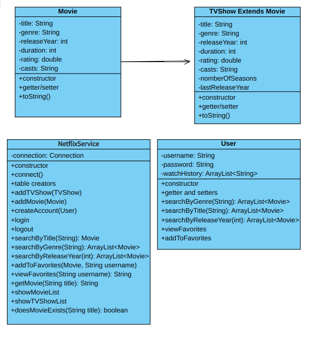
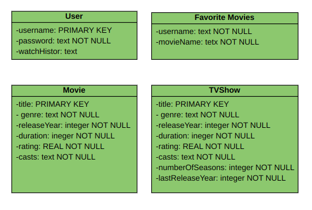

#IN GOD WE TRUST

#FORTH ASSIGNMENT

##Rana Rokni 401222066

1.Introduction

In this assignment I built a terminal based program named NetflixService which is a netflix simulated app in which users can login, see movie and TVShow lists, have favorite and watching list and they can also update them.

2. Design and Implement

The app is written in Java programming, follows OOP and encapsulation principles to better protect the data.
HashMap and ArraLists are the data structures being used in the program, and I used sqlite to better store data, by importing java.sql library [Java SQL Library](https://docs.oracle.com/javase/8/docs/api/java/sql/package-summary.html)( At first I was using mySQL to store data, due to its complicity( which wasn't necessary) decided to change my way and use sqlite)

To have secure passwords, they would be hashed with MD5 hashing algorithm and by the help of [Java MessageDigest library](https://docs.oracle.com/javase/7/docs/api/java/security/MessageDigest.html). The MD5 (message-digest algorithm) hashing algorithm is a one-way cryptographic function that accepts a message of any length as input and returns as output a fixed-length digest value to be used for authenticating the original message.

User's input information would be checked to be valid, for example user can not add a movie to his/ her watching list/ favorite list which does not exist and also valid inputs to choose from menus is being checked.

There are 4 classes in this program: User, Movie, TVShow which extends Movie class(TVShows have more attributes like number of seasons and etc.) and NetflixService which is an object to manage database. Main class includes different menus. The UML bellow shows the instructor comprehensively.

Recording Users' watch history and favorite movie was a challenge. the first thing I did was to create separate database watch history and favorite movie tables for each user, which wasn't efficient at all. To solve this problem I decided to restore watch list as a string and an attribute of user and have a separate table of all users' favorite movies linked to their unique username. Other tables are shown in database UML: 

3. Testing and Evaluation

The program has been tested in traditional way and by handy entering the values and has some problems to be solved in the future. 

4. Conclusion

The report concludes the aspects of the library app project, which can be improved by adding GUI, more user options and better input validation.

